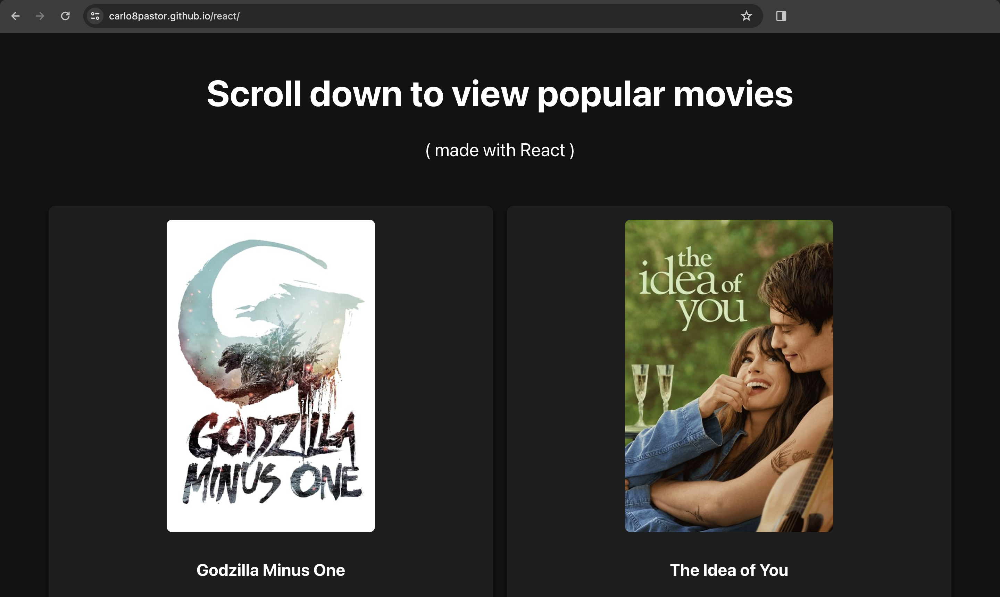

# React Version from 'Comparative Performance Analysis of React, Vue.js and Svelte'



## Live Webpage

The live webpage can be accessed [here](https://carlo8pastor.github.io/react/).

## If Reader wants to Run the React Webpage Locally:

Type the following commands in your computer's terminal:

1. Clone this repository to your local machine:

    ```
    git clone https://github.com/carlo8pastor/react.git
    ```

2. Navigate to the `react` directory:

    ```
    cd react
    ```

3. Install the necessary dependencies using npm:

    ```
    npm install
    ```

4. Once the dependencies are installed, you can start the development server:

    ```
    npm start
    ```

5. Open your browser and visit the http://localhost link that your terminal displays.

